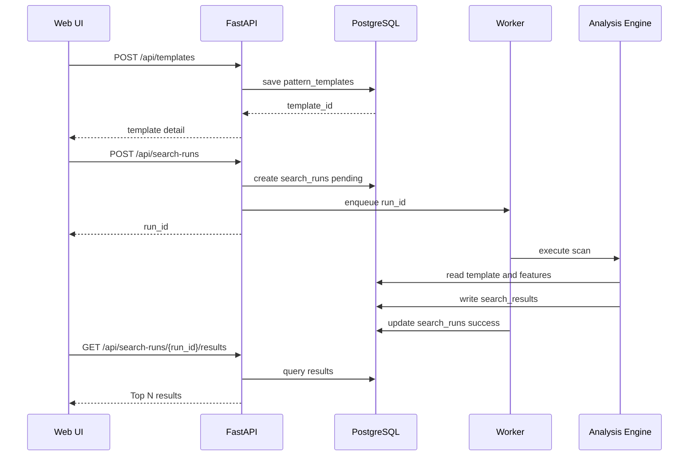
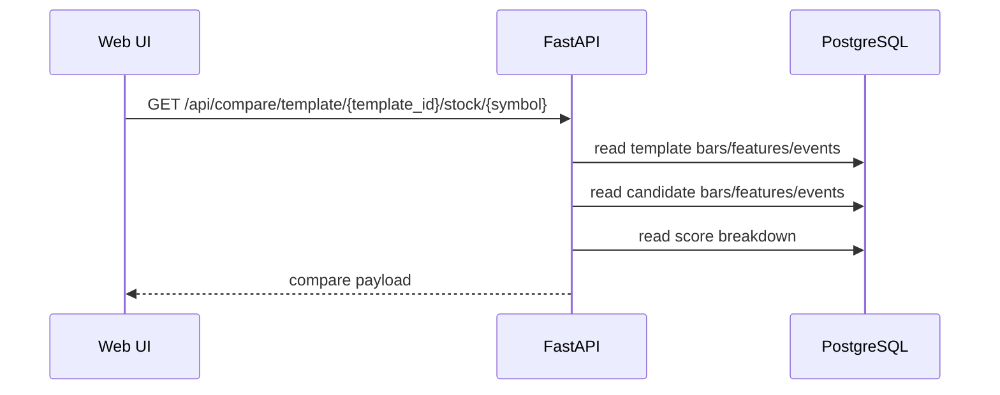

# PSE API 流程图

## 1. 创建模板并扫描

```mermaid
sequenceDiagram
    participant UI as Web UI
    participant API as FastAPI
    participant DB as PostgreSQL
    participant Worker as Worker
    participant Engine as Analysis Engine

    UI->>API: POST /api/templates
    API->>DB: save pattern_templates
    DB-->>API: template_id
    API-->>UI: template detail

    UI->>API: POST /api/search-runs
    API->>DB: create search_runs pending
    API->>Worker: enqueue run_id
    API-->>UI: run_id

    Worker->>Engine: execute scan
    Engine->>DB: read template and features
    Engine->>DB: write search_results
    Worker->>DB: update search_runs success

    UI->>API: GET /api/search-runs/{run_id}/results
    API->>DB: query results
    API-->>UI: Top N results
```

## 2. 股票对比详情

```mermaid
sequenceDiagram
    participant UI as Web UI
    participant API as FastAPI
    participant DB as PostgreSQL

    UI->>API: GET /api/compare/template/{template_id}/stock/{symbol}
    API->>DB: read template bars/features/events
    API->>DB: read candidate bars/features/events
    API->>DB: read score breakdown
    API-->>UI: compare payload
```
