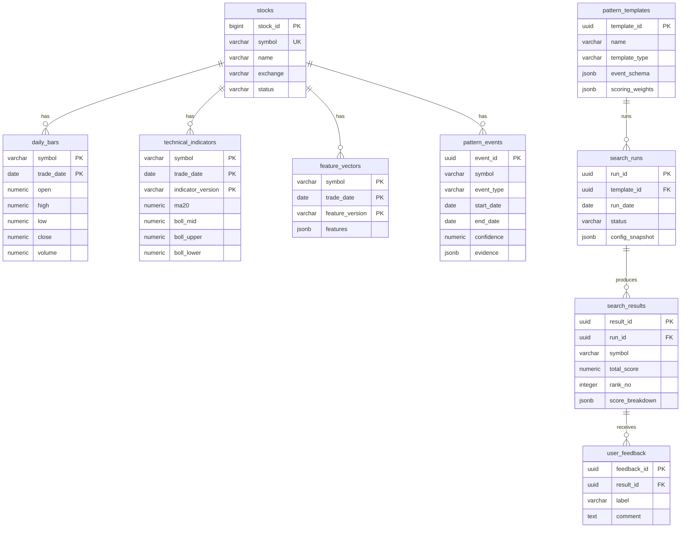

# PSE ER 图

```mermaid
erDiagram
    stocks ||--o{ daily_bars : has
    stocks ||--o{ technical_indicators : has
    stocks ||--o{ feature_vectors : has
    stocks ||--o{ pattern_events : has

    pattern_templates ||--o{ search_runs : runs
    search_runs ||--o{ search_results : produces
    search_results ||--o{ user_feedback : receives

    stocks {
        bigint stock_id PK
        varchar symbol UK
        varchar name
        varchar exchange
        varchar status
    }

    daily_bars {
        varchar symbol PK
        date trade_date PK
        numeric open
        numeric high
        numeric low
        numeric close
        numeric volume
    }

    technical_indicators {
        varchar symbol PK
        date trade_date PK
        varchar indicator_version PK
        numeric ma20
        numeric boll_mid
        numeric boll_upper
        numeric boll_lower
    }

    feature_vectors {
        varchar symbol PK
        date trade_date PK
        varchar feature_version PK
        jsonb features
    }

    pattern_events {
        uuid event_id PK
        varchar symbol
        varchar event_type
        date start_date
        date end_date
        numeric confidence
        jsonb evidence
    }

    pattern_templates {
        uuid template_id PK
        varchar name
        varchar template_type
        jsonb event_schema
        jsonb scoring_weights
    }

    search_runs {
        uuid run_id PK
        uuid template_id FK
        date run_date
        varchar status
        jsonb config_snapshot
    }

    search_results {
        uuid result_id PK
        uuid run_id FK
        varchar symbol
        numeric total_score
        integer rank_no
        jsonb score_breakdown
    }

    user_feedback {
        uuid feedback_id PK
        uuid result_id FK
        varchar label
        text comment
    }
```
