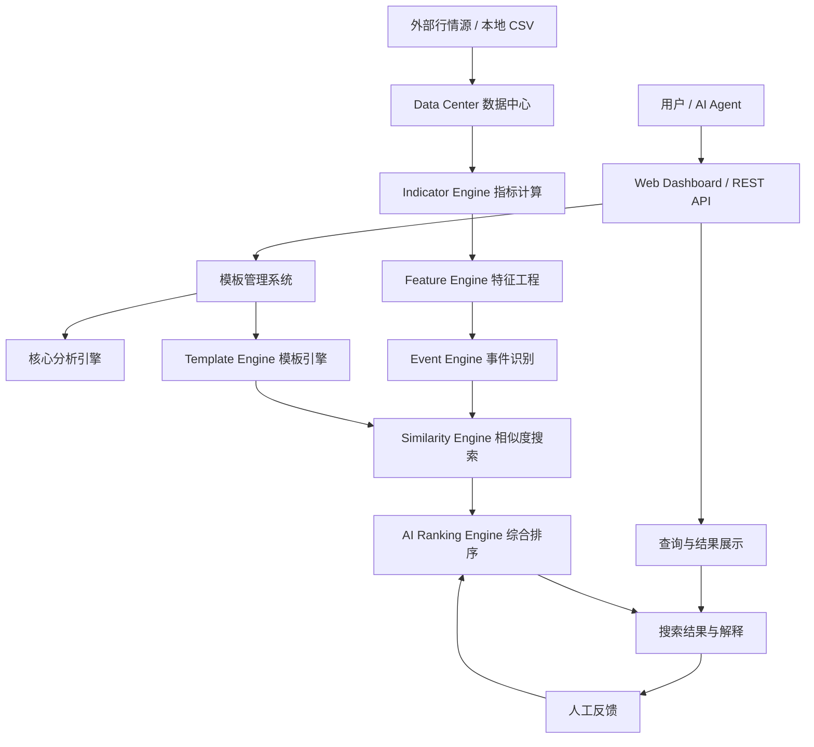
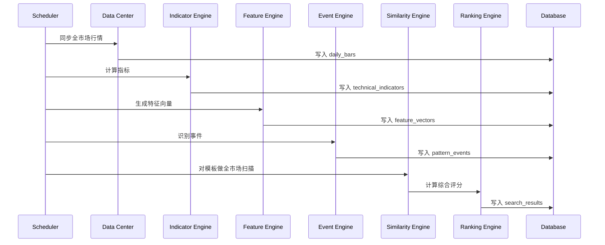
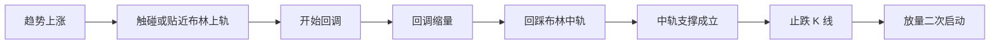
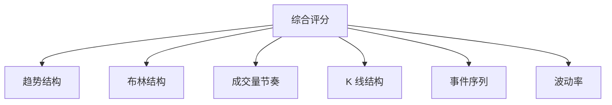

# PSE 架构图

## 1. 系统总体架构

```mermaid
flowchart TD
    U["用户 / AI Agent"] --> W["Web Dashboard / REST API"]
    W --> T["模板管理系统"]
    W --> Q["查询与结果展示"]
    T --> C["核心分析引擎"]
    Q --> R["搜索结果与解释"]

    S["外部行情源 / 本地 CSV"] --> D["Data Center 数据中心"]
    D --> I["Indicator Engine 指标计算"]
    I --> F["Feature Engine 特征工程"]
    F --> E["Event Engine 事件识别"]
    T --> M["Template Engine 模板引擎"]
    E --> SE["Similarity Engine 相似度搜索"]
    M --> SE
    SE --> A["AI Ranking Engine 综合排序"]
    A --> R
    R --> FB["人工反馈"]
    FB --> A
```

## 2. 每日任务流程

```mermaid
sequenceDiagram
    participant Scheduler as Scheduler
    participant Data as Data Center
    participant Indicator as Indicator Engine
    participant Feature as Feature Engine
    participant Event as Event Engine
    participant Similarity as Similarity Engine
    participant Ranking as Ranking Engine
    participant DB as Database

    Scheduler->>Data: 同步全市场行情
    Data->>DB: 写入 daily_bars
    Scheduler->>Indicator: 计算指标
    Indicator->>DB: 写入 technical_indicators
    Scheduler->>Feature: 生成特征向量
    Feature->>DB: 写入 feature_vectors
    Scheduler->>Event: 识别事件
    Event->>DB: 写入 pattern_events
    Scheduler->>Similarity: 对模板做全市场扫描
    Similarity->>Ranking: 计算综合评分
    Ranking->>DB: 写入 search_results
```

## 3. 内置模板事件链

```mermaid
flowchart LR
    A["趋势上涨"] --> B["触碰或贴近布林上轨"]
    B --> C["开始回调"]
    C --> D["回调缩量"]
    D --> E["回踩布林中轨"]
    E --> F["中轨支撑成立"]
    F --> G["止跌 K 线"]
    G --> H["放量二次启动"]
```

## 4. 评分结构

```mermaid
flowchart TD
    S["综合评分"] --> T["趋势结构"]
    S --> B["布林结构"]
    S --> V["成交量节奏"]
    S --> K["K 线结构"]
    S --> E["事件序列"]
    S --> R["波动率"]
```
